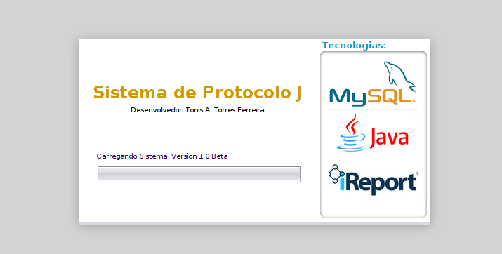
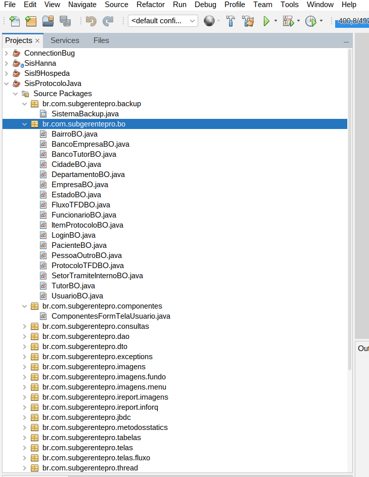
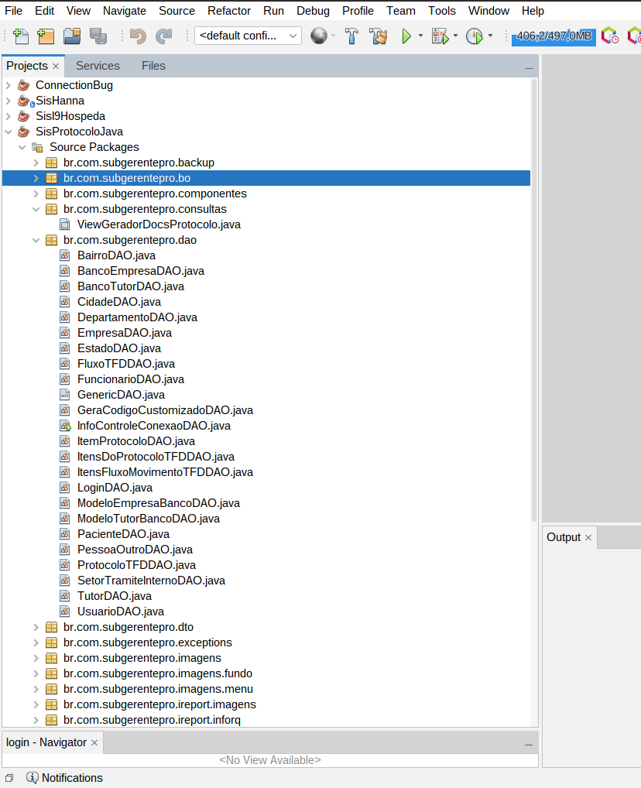
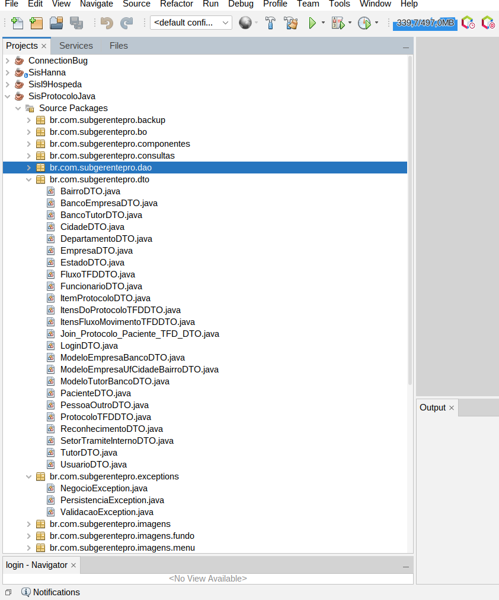
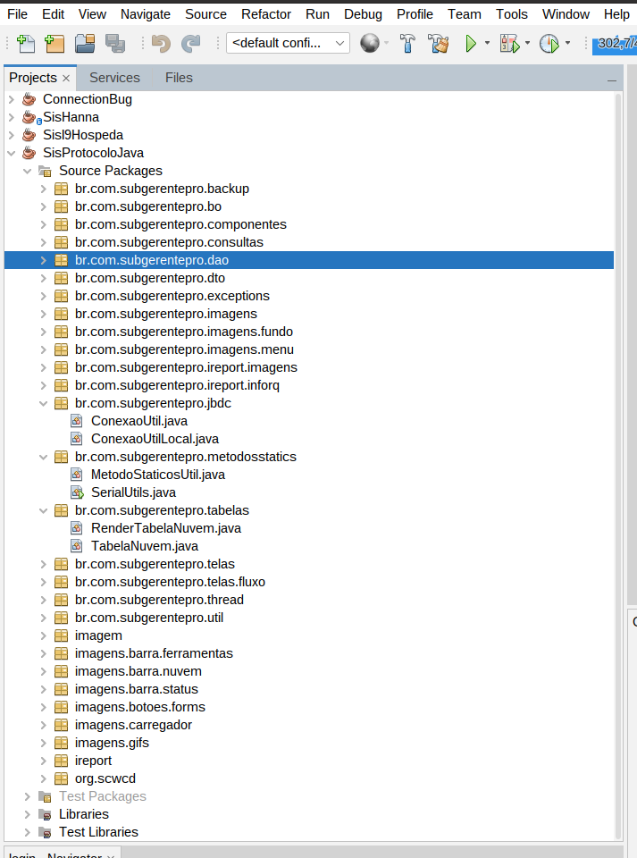
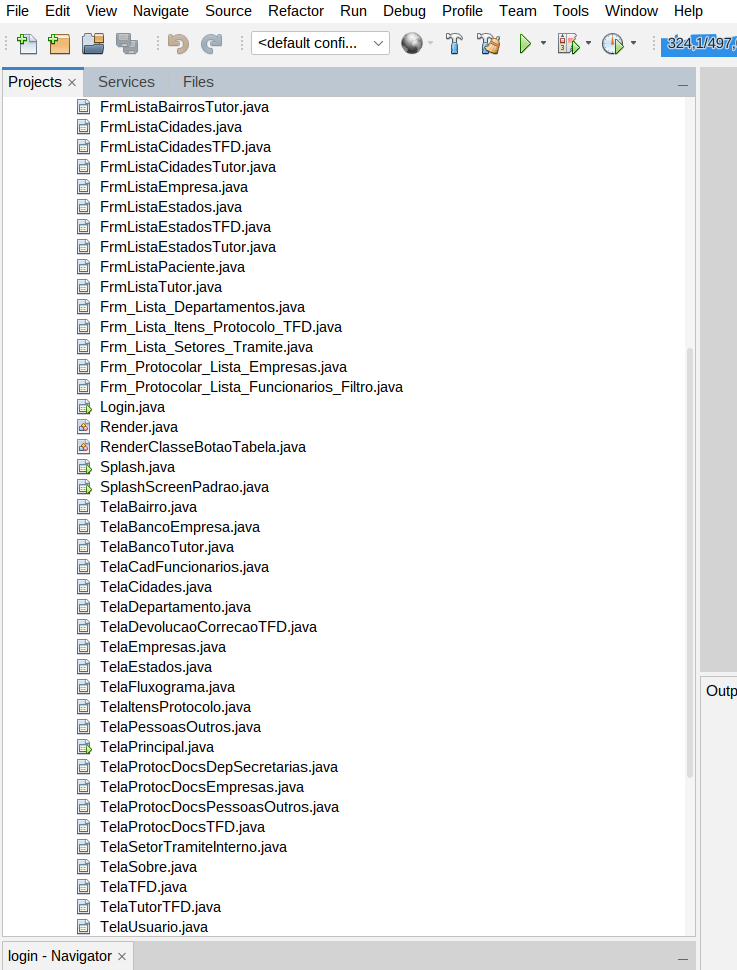
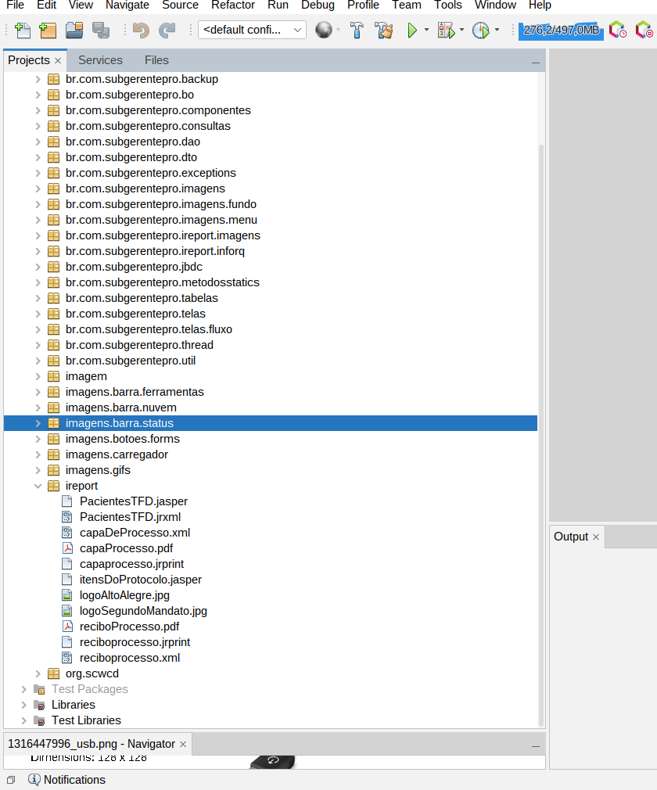

<h2> Sistema de Protocolo (SisProtocolo)</h2>
<h3> Discorra sobre o Sistema de Protocolo:</h3>
<textarea   rows="5" cols="53">O Sistema de Protocolo foi desenvolvido para atender o fluxo e controle de processos de TFD(Tratamento Fora do Domicílio) da Cidade de Alto Alegre do Maranhão </textarea>

<h4>Ferramentas Utilizadas:</h4>
<ol>
<li>Framework Netbenas;</li>
<li>Framework JasperStudio;</li>
<li>Linguagem de Programação Java(Desktop);</li>
<li>Gerenciador de Banco de Dados MySQL;</li>
<li>Linguagem de Consulta SQL;</li>
</ol>

#### Imagem das Telas dos Principais Pacotes do Sistema:

<strong>💁‍♂️ Click/Estender </strong>
 

-   [x] -   Estrutura Geral de Pastas do Projeto;

-   [x] -   Pacote das Classes BO(business Object)

-   [x] -   Pacote das Classes DAO (Data Acess Object)

-   [x] -   Pacote das Classes DTO (Data Transfer Object)

-   [x] -   Pacote contendo as Classes de Conexão com Banco de Dados;

-   [x] -   Pacote contendo as Classes de Interface Gráfica do Usuário (Forms);

-   [x] -   Pacote contendo arquivos relativos a relatórios do sistema;

