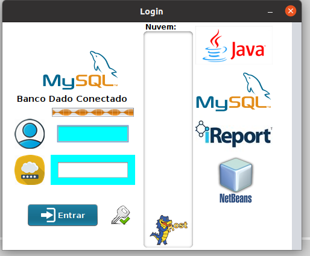
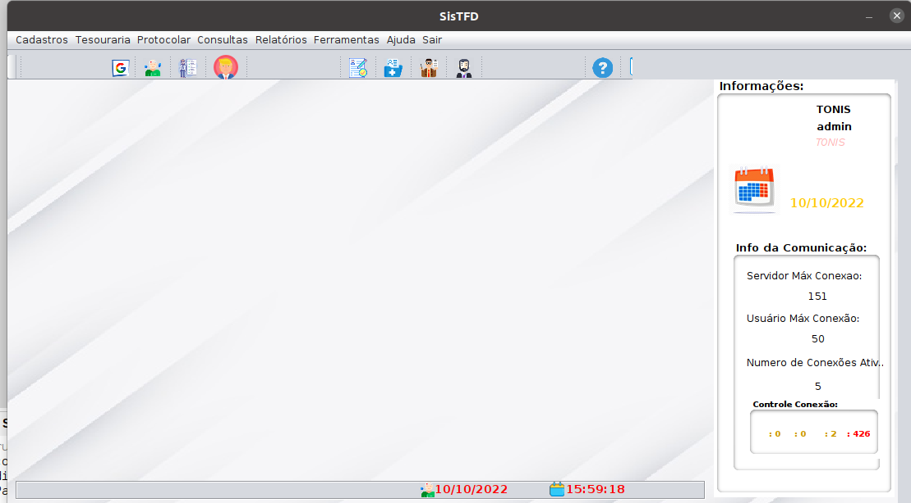

<h2> Sistema de Protocolo (SisProtocolo)</h2>
<h3> Discorra sobre o Sistema de Protocolo:</h3>


> O Sistema de Protocolo foi desenvolvido para atender o fluxo e controle de processos de TFD(Tratamento Fora do Domicílio) da Cidade de Alto Alegre do Maranhão. 


<h4>Ferramentas Utilizadas:</h4>
<ol>
<li>Framework Netbenas;</li>
<li>Framework JasperStudio;</li>
<li>Linguagem de Programação Java(Desktop);</li>
<li>Gerenciador de Banco de Dados MySQL;</li>
<li>Linguagem de Consulta SQL;</li>
<li>Dockerizando SGBD MySQL;</li>
</ol>


#### Imagem das Telas dos Principais Pacotes do Sistema:

<details>
<summary><strong>💁‍♂️ Click/Estender </strong></summary><br />

-   [x] -   Estrutura Geral de Pastas do Projeto;


-   [x] -   Pacote das Classes BO(business Object)


-   [x] -   Pacote das Classes DAO (Data Acess Object)


-   [x] -   Pacote das Classes DTO (Data Transfer Object)


-   [x] -   Pacote contendo as Classes de Conexão com Banco de Dados;


-   [x] -   Pacote contendo as Classes de Interface Gráfica do Usuário (Forms);


-   [x] -   Pacote contendo arquivos relativos a relatórios do sistema;


-   [x] -   Tela de Login;




-   [x] -   Tela de Principal;



</details>


#### Docker Gerenciador Banco de Dados Mysql:


### Dockerizando aplicação:

> Dockerizando o Gerenciador de Banco de Dados MySQL.

```yml
version: '3.9'

services:
  db:
    image: mysql:5.7
    platform: linux/x86_64
    container_name: db
    ports:
      - 3306:3306
    environment:
      - MYSQL_ROOT_PASSWORD=1020
    restart: 'always'
    healthcheck:
      test: ["CMD", "mysqladmin" ,"ping", "-h", "localhost"] # Deve aguardar o banco ficar operacional
      timeout: 10s
      retries: 5
    cap_add:
      - SYS_NICE # Deve omitir alertas menores          
```

> Para rodar o arquivo docker-compose digite o comando abaixo explicitado.

```console
docker-compose up -d
```


#### Script SQL usado na Construção Do Banco:


```sql
-- -----------------------------------------------------
-- Table `infoq`.`estados`
-- -----------------------------------------------------
DROP TABLE IF EXISTS `infoq`.`estados` ;

CREATE  TABLE IF NOT EXISTS `infoq`.`estados` (
  `id_estado` INT(11) NOT NULL AUTO_INCREMENT ,
  `nome_estado` VARCHAR(45) NOT NULL ,
  `sigla_estado` VARCHAR(45) NOT NULL ,
  PRIMARY KEY (`id_estado`) )
ENGINE = InnoDB
AUTO_INCREMENT = 28
DEFAULT CHARACTER SET = utf8;


-- -----------------------------------------------------
-- Table `infoq`.`cidades`
-- -----------------------------------------------------
DROP TABLE IF EXISTS `infoq`.`cidades` ;

CREATE  TABLE IF NOT EXISTS `infoq`.`cidades` (
  `id_cidade` INT(11) NOT NULL AUTO_INCREMENT ,
  `nome_cidade` VARCHAR(45) NOT NULL ,
  `fk_id_estado` INT(11) NOT NULL ,
  PRIMARY KEY (`id_cidade`) ,
  INDEX `fk_id_estado_idx` (`fk_id_estado` ASC) ,
  CONSTRAINT `fk_id_estado`
    FOREIGN KEY (`fk_id_estado` )
    REFERENCES `infoq`.`estados` (`id_estado` )
    ON DELETE NO ACTION
    ON UPDATE NO ACTION)
ENGINE = InnoDB
AUTO_INCREMENT = 2
DEFAULT CHARACTER SET = utf8;


-- -----------------------------------------------------
-- Table `infoq`.`bairros`
-- -----------------------------------------------------
DROP TABLE IF EXISTS `infoq`.`bairros` ;

CREATE  TABLE IF NOT EXISTS `infoq`.`bairros` (
  `id_bairro` INT(11) NOT NULL AUTO_INCREMENT ,
  `nome_bairro` VARCHAR(45) NOT NULL ,
  `fk_cidade` INT(11) NOT NULL ,
  PRIMARY KEY (`id_bairro`) ,
  INDEX `fk_cidade_idx` (`fk_cidade` ASC) ,
  CONSTRAINT `fk_cidade`
    FOREIGN KEY (`fk_cidade` )
    REFERENCES `infoq`.`cidades` (`id_cidade` )
    ON DELETE NO ACTION
    ON UPDATE NO ACTION)
ENGINE = InnoDB
AUTO_INCREMENT = 12
DEFAULT CHARACTER SET = utf8;


-- -----------------------------------------------------
-- Table `infoq`.`tbempresa`
-- -----------------------------------------------------
DROP TABLE IF EXISTS `infoq`.`tbempresa` ;

CREATE  TABLE IF NOT EXISTS `infoq`.`tbempresa` (
  `idEmpresa` INT(11) NOT NULL DEFAULT '0' ,
  `CNPJ` VARCHAR(18) NOT NULL ,
  `Empresa` VARCHAR(50) NOT NULL ,
  `fk_estado` INT(11) NOT NULL ,
  `fk_cidade` INT(11) NOT NULL ,
  `bairro` VARCHAR(50) NULL DEFAULT NULL ,
  `endereco` VARCHAR(60) NULL DEFAULT NULL ,
  `complemento` VARCHAR(50) NULL DEFAULT NULL ,
  `numero` VARCHAR(10) NULL DEFAULT NULL ,
  `foneComercial` VARCHAR(20) NULL DEFAULT NULL ,
  `celular` VARCHAR(20) NULL DEFAULT NULL ,
  `contato` VARCHAR(60) NULL DEFAULT NULL ,
  PRIMARY KEY (`idEmpresa`) ,
  UNIQUE INDEX `contato_UNIQUE` (`contato` ASC) )
ENGINE = InnoDB
DEFAULT CHARACTER SET = latin1;


-- -----------------------------------------------------
-- Table `infoq`.`tbbancoempresa`
-- -----------------------------------------------------
DROP TABLE IF EXISTS `infoq`.`tbbancoempresa` ;

CREATE  TABLE IF NOT EXISTS `infoq`.`tbbancoempresa` (
  `int` INT(11) NOT NULL ,
  `fk_id_empresa` INT(11) NOT NULL ,
  `favorecido` VARCHAR(50) NOT NULL ,
  `Banco` VARCHAR(45) NOT NULL ,
  `ContaCorrente` VARCHAR(15) NOT NULL ,
  `tbempresa_idEmpresa` INT(11) NOT NULL ,
  PRIMARY KEY (`int`, `tbempresa_idEmpresa`) ,
  INDEX `fk_tbbancoempresa_tbempresa1_idx` (`tbempresa_idEmpresa` ASC) ,
  CONSTRAINT `fk_tbbancoempresa_tbempresa1`
    FOREIGN KEY (`tbempresa_idEmpresa` )
    REFERENCES `infoq`.`tbempresa` (`idEmpresa` )
    ON DELETE NO ACTION
    ON UPDATE NO ACTION)
ENGINE = InnoDB
DEFAULT CHARACTER SET = latin1;


-- -----------------------------------------------------
-- Table `infoq`.`tbbancofuncionario`
-- -----------------------------------------------------
DROP TABLE IF EXISTS `infoq`.`tbbancofuncionario` ;

CREATE  TABLE IF NOT EXISTS `infoq`.`tbbancofuncionario` (
  `int` INT(11) NOT NULL ,
  `fk_id_empresa` INT(11) NOT NULL ,
  `favorecido` VARCHAR(50) NOT NULL ,
  `Banco` VARCHAR(45) NOT NULL ,
  `ContaCorrente` VARCHAR(15) NOT NULL ,
  PRIMARY KEY (`int`) )
ENGINE = InnoDB
DEFAULT CHARACTER SET = latin1;


-- -----------------------------------------------------
-- Table `infoq`.`tbbancooutros`
-- -----------------------------------------------------
DROP TABLE IF EXISTS `infoq`.`tbbancooutros` ;

CREATE  TABLE IF NOT EXISTS `infoq`.`tbbancooutros` (
  `int` INT(11) NOT NULL ,
  `fk_id_empresa` INT(11) NOT NULL ,
  `favorecido` VARCHAR(50) NOT NULL ,
  `Banco` VARCHAR(45) NOT NULL ,
  `ContaCorrente` VARCHAR(15) NOT NULL ,
  PRIMARY KEY (`int`) )
ENGINE = InnoDB
DEFAULT CHARACTER SET = latin1;


-- -----------------------------------------------------
-- Table `infoq`.`tbbancotfd`
-- -----------------------------------------------------
DROP TABLE IF EXISTS `infoq`.`tbbancotfd` ;

CREATE  TABLE IF NOT EXISTS `infoq`.`tbbancotfd` (
  `int` INT(11) NOT NULL ,
  `fk_id_empresa` INT(11) NOT NULL ,
  `favorecido` VARCHAR(50) NOT NULL ,
  `Banco` VARCHAR(45) NOT NULL ,
  `ContaCorrente` VARCHAR(15) NOT NULL ,
  PRIMARY KEY (`int`) )
ENGINE = InnoDB
DEFAULT CHARACTER SET = latin1;


-- -----------------------------------------------------
-- Table `infoq`.`tbclientetfd`
-- -----------------------------------------------------
DROP TABLE IF EXISTS `infoq`.`tbclientetfd` ;

CREATE  TABLE IF NOT EXISTS `infoq`.`tbclientetfd` (
  `int` INT(11) NOT NULL ,
  `fk_id_empresa` INT(11) NOT NULL ,
  `favorecido` VARCHAR(50) NOT NULL ,
  `Banco` VARCHAR(45) NOT NULL ,
  `ContaCorrente` VARCHAR(15) NOT NULL ,
  PRIMARY KEY (`int`) )
ENGINE = InnoDB
DEFAULT CHARACTER SET = latin1;


-- -----------------------------------------------------
-- Table `infoq`.`tbusuarios`
-- -----------------------------------------------------
DROP TABLE IF EXISTS `infoq`.`tbusuarios` ;

CREATE  TABLE IF NOT EXISTS `infoq`.`tbusuarios` (
  `iduser` INT(11) NOT NULL AUTO_INCREMENT ,
  `usuario` VARCHAR(50) NOT NULL ,
  `telefone` VARCHAR(15) NULL DEFAULT NULL ,
  `login` VARCHAR(10) NOT NULL ,
  `senha` VARCHAR(10) NULL DEFAULT NULL ,
  `perfil` VARCHAR(8) NOT NULL ,
  PRIMARY KEY (`iduser`) ,
  UNIQUE INDEX `iduser_UNIQUE` (`iduser` ASC) ,
  UNIQUE INDEX `login_UNIQUE` (`login` ASC) )
ENGINE = InnoDB
AUTO_INCREMENT = 11
DEFAULT CHARACTER SET = latin1;


```
